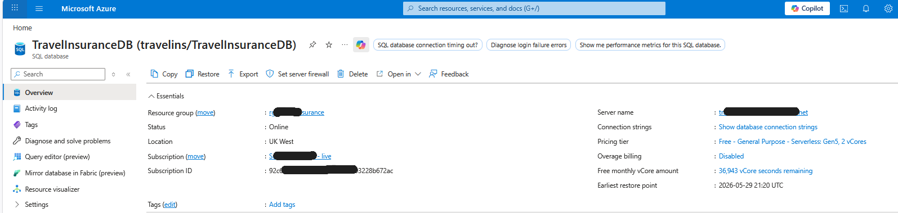
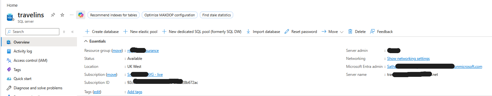
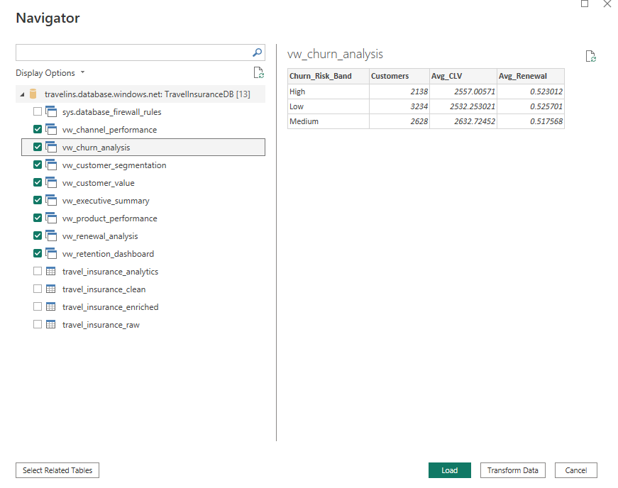

# Travel Insurance Customer Retention & Revenue Analytics


###  End-to-End Azure SQL, Python, Data Engineering & Power BI Analytics Solution

---

##  Project Overview

This project demonstrates an end-to-end Business Intelligence and Customer Analytics solution built using Azure SQL Database, Python, SQLAlchemy, DAX, and Power BI.

The solution was designed to simulate a real-world Travel Insurance analytics platform, transforming raw customer and policy data into actionable business insights that support customer retention, revenue optimisation, and strategic decision-making.

  ---

##  Project Highlights

- Designed and implemented a multi-layer Azure SQL architecture (Raw, Clean, Analytics, Enriched)
- Loaded and transformed travel insurance policy data in Azure SQL Database
- Performed exploratory data analysis (EDA) using Python and Pandas
- Developed customer segmentation, churn risk, and next best action models
- Created SQL analytics views for business reporting and performance monitoring
- Built an interactive Power BI dashboard with KPI reporting, churn analytics, retention insights, and revenue analysis
- Delivered actionable recommendations to support customer retention and revenue growth

---

##  Skills Demonstrated

### Data Engineering
- Azure SQL Database
- SQL Data Modelling
- Data Cleansing
- Data Transformation
### Analytics
- Customer Segmentation
- Churn Analytics
- Retention Analytics
- Revenue Analysis
### Python
- Pandas
- SQLAlchemy
- Exploratory Data Analysis
- Feature Engineering
### Business Intelligence
- Power BI
- DAX
- Dashboard Design
- Interactive Reporting
---

## Business Scenario

Travel insurance providers need to understand:

- Which products generate the highest revenue
- Which customer segments are most valuable
- Which customers are at risk of churn
- Which retention actions should be prioritised
- How premium revenue changes over time
- Which sales channels drive the highest value customers

This solution provides stakeholders with actionable insights to support marketing, retention and business growth strategies.

---

## Technology Stack

| Technology | Purpose |
|------------|----------|
| Azure SQL Database | Cloud Data Warehouse |
| Python | Data Cleansing & Feature Engineering |
| Pandas | Data Transformation |
| SQLAlchemy | Azure SQL Connectivity |
| Matplotlib | Exploratory Data Analysis |
| SQL Views | Business Analytics Layer |
| Power BI | Dashboard & Visualisation |
| DAX | KPI Calculations & Measures |

---

## Repository Structure

```text
data/
powerbi/
python/
screenshots/
sql/
README.md
```

## Solution Architecture

```text
Travel Insurance Dataset (CSV)
            │
            ▼
Azure SQL Database
(travel_insurance_raw)
            │
            ▼
Data Cleansing Layer
(travel_insurance_clean)
            │
            ▼
Analytics Layer
(travel_insurance_analytics)
            │
            ▼
Feature Engineering
(travel_insurance_enriched)
            │
            ▼
Business Views
(SQL Analytics Views)
            │
            ▼
Power BI Dashboard
            │
            ▼
Business Insights
```

---

## Dataset

A synthetic Travel Insurance dataset containing approximately 8,000 customer records was generated for analytical purposes.

### Products

- Annual Multi Trip
- Single Trip
- Backpacker
- Winter Sports
- Cruise

### Core Attributes

- Customer_ID
- Policy_ID
- Product
- Premium_GBP
- Claim_Amount_GBP
- Customer_Age
- Cover_Level
- Region
- Destination
- Sales_Channel
- Renewal_Probability
- Churn_Risk_Score
- Customer_Lifetime_Value_GBP

---

## Azure SQL Architecture

The travel insurance dataset was loaded into Azure SQL Database using a multi-layer architecture designed to support data quality, analytics, and reporting.
Azure SQL was configured to support connectivity from SSMS, Python and Power BI.

| Layer | Table | Purpose |
|---------|---------|---------|
| Raw | travel_insurance_raw | Original imported dataset |
| Clean | travel_insurance_clean | Data cleansing and validation |
| Analytics | travel_insurance_analytics | Business rules and derived metrics |
| Enriched | travel_insurance_enriched | Feature engineering and customer analytics |

Key transformations included:

- Data type standardisation
- Null value handling
- Churn Risk Band creation
- CLV Band creation
- Renewal Band creation
- Claim Status derivation
- Customer Segmentation
- Next Best Action modelling
- Policy Sale Date generation

### Azure SQL Server



### Azure SQL Database



### Azure SQL Login Configuration


---

## Python Integration, EDA & Feature Engineering

Python was used to connect to Azure SQL Database, perform exploratory data analysis (EDA), engineer analytical features, and write enriched datasets back to Azure SQL for reporting and dashboard development.

### Azure SQL Connection Example

```python
from sqlalchemy import create_engine
import pandas as pd

engine = create_engine(connection_string)

df = pd.read_sql(
    "SELECT * FROM dbo.travel_insurance_enriched",
    engine
)
```

### Technologies Used

- Python
- Pandas
- SQLAlchemy
- ODBC Driver 18 for SQL Server
- Matplotlib

### Key Activities

- Data extraction from Azure SQL Database
- Dataset validation and profiling
- Exploratory data analysis (EDA)
- Churn risk and renewal probability analysis
- Customer Lifetime Value (CLV) assessment
- Correlation analysis between key business metrics
- Customer segmentation
- Feature engineering
- Next Best Action modelling
- Writing enriched datasets back to Azure SQL

### Analytical Features Created

- Churn Risk Band (Low, Medium, High)
- CLV Band (Low Value, Medium Value, High Value)
- Claim Status (Claim / No Claim)
- Renewal Band (Likely Renew, Possible Renew, Unlikely Renew)
- Customer Segment (Bronze, Silver, Gold, Platinum)
- Next Best Action (Retain, Upsell, Cross Sell, Reactivate, No Action)
- Policy Sale Date for Year-over-Year (YoY) analysis

### Customer Churn Risk Distribution


### Correlation Analysis


---

## SQL Analytics Views

Business-facing SQL views were created to support reporting and dashboard development:

- vw_product_performance
- vw_customer_segmentation
- vw_churn_analysis
- vw_customer_value
- vw_channel_performance
- vw_renewal_analysis
- vw_executive_summary

These views provide aggregated metrics for revenue analysis, customer segmentation, churn monitoring, retention analysis and executive reporting.

---

## Power BI Dashboard

### Executive Dashboard


Developed an interactive dashboard featuring:

### Interactive Filters

- Product
- Cover Level
- Customer Segment
- Sales Channel
- Sale Year

---

### KPI Cards

- Total Customers
- Average Churn Risk %
- Average Renewal %
- Average Customer Lifetime Value
- YoY Premium Growth %

---

## Dashboard Visuals

### YoY Premium Sales by Customer Segment

Small multiples visual showing:

- Bronze
- Silver
- Gold
- Platinum

revenue trends across multiple years.

---

### Premium Sales by Product

Bar chart comparing:

- Annual Multi Trip
- Backpacker
- Winter Sports
- Single Trip
- Cruise

---

### Customer Retention Strategy Recommendations

Treemap visual displaying:

- Retain
- Upsell
- Reactivate
- Cross Sell
- No Action

for high-risk customers.

---

### Churn Risk by Cover Level

Combination chart analysing:

**Premium Revenue vs Average Churn Risk**

across:

- Basic
- Standard
- Premium

cover levels.

---

### Premium Revenue Driver Analysis

Decomposition Tree visual enabling drill-down by:

- Product
- Customer Segment
- Next Best Action
- Cover Level

to identify revenue drivers and retention opportunities.

---

## Sample DAX Modelling

The Power BI dashboard was developed using DAX calculated columns, calculated tables, and measures to support KPI reporting, customer analytics, and performance monitoring.

### Customer Segment (Calculated Column)

```DAX
Customer Segment =
SWITCH(
    TRUE(),
    travel_insurance_enriched[Customer_Lifetime_Value_GBP] >= 3000, "Platinum",
    travel_insurance_enriched[Customer_Lifetime_Value_GBP] >= 2000, "Gold",
    travel_insurance_enriched[Customer_Lifetime_Value_GBP] >= 1000, "Silver",
    "Bronze"
)
```

### Customer Segment Summary (Calculated Table)

```DAX
Customer Segment Summary =
SUMMARIZE(
    travel_insurance_enriched,
    travel_insurance_enriched[Customer_Segment],
    "Customer Count", COUNT(travel_insurance_enriched[Customer_ID]),
    "Total Premium", SUM(travel_insurance_enriched[Premium_GBP]),
    "Average CLV", AVERAGE(travel_insurance_enriched[Customer_Lifetime_Value_GBP])
)
```

### High Risk Customers (Measure)

```DAX
High Risk Customers =
CALCULATE(
    COUNTROWS(travel_insurance_enriched),
    travel_insurance_enriched[Churn_Risk_Score] > 0.6
)
```

---


## Key Business Insights

### Customer Retention

- The majority of high-risk customers require **Retain** and **Upsell** interventions.
- Retain and Upsell are the most frequently recommended customer retention actions.
- Customer Lifetime Value (CLV) strongly influences renewal probability and retention outcomes.

### Revenue Drivers

- Premium revenue is heavily influenced by **Product Type**, **Customer Segment**, and **Cover Level**.
- Gold and Platinum customer segments generate the highest premium revenue and customer lifetime value.
- Annual Multi Trip and Backpacker products generate the highest premium revenue.
- Premium cover customers exhibit lower churn risk compared to Basic cover customers.

### Strategic Recommendations

- Prioritise retention campaigns for high-risk, high-value customers.
- Increase Upsell opportunities among customers with strong renewal potential.
- Focus marketing efforts on high-performing products and customer segments to maximise revenue growth.

---

## Project Outcomes

Successfully delivered an end-to-end customer retention and revenue analytics platform capable of transforming raw travel insurance data into actionable business insights supporting:

- Customer Retention
- Revenue Optimisation
- Churn Reduction
- Marketing Effectiveness
- Strategic Decision Making

---

## Power BI Integration

The Azure SQL Database was connected directly to Power BI Desktop using SQL Server connectivity. Business-facing analytical views were imported to support dashboard development.

### Power BI Connection to Azure SQL Database




## Future Enhancements

- Machine Learning Churn Prediction Model
- Automated Azure Data Factory Pipeline
- Power BI Service Deployment
- Incremental Data Refresh
- Customer Lifetime Value Forecasting
  
## Author

### Satheesh Gurusamy

### Connect With Me

- LinkedIn : https://www.linkedin.com/in/satheeshgurusamy
- Web : www.sgsamy.com
- GitHub : https://github.com/SGSAMY
